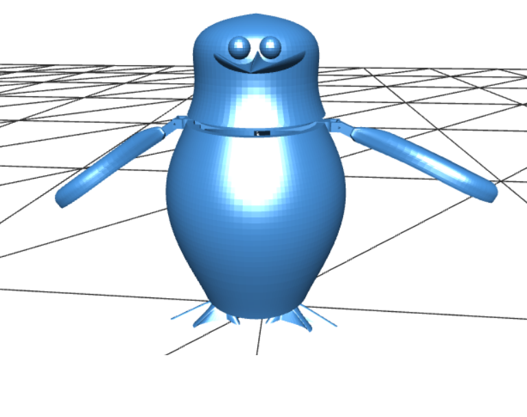

# Skipper The Penguin Project

# **Contents**

  ##  Introduction 

  ##  Project Outline

  ###  ~ MoSCoW

  ###  ~ Technologies Available and Explored

   #### - Computer Aided Design (CAD) software package

   #### - 3D scanning 

   #### - Motion capture 

   #### - Haptic input 

   #### - 3D printing 

   #### - Conclusion 

  ##  Design 

  ### ~ Version 1 

  ### ~ Version 2 

  ##  Development 

  ##  Conclusion and Reflection 

  ##  References 

  ##  Appendices 

#
# **Introduction**

The aim of this project is to develop an exoskeletal, that has a working hinge and a skin of sorts which could be used for robotic and animatronic applications. To carry out this aim various techniques, technologies, and research will be carried out. The project will also look at and analyse the transition from a virtual design to a physical prototype, documenting each phase of the project lifecycle.

# **Project Outline**

The prototype for the project will be based on the beloved character Skipper, who is the leader of the penguins, form the animated Madagascar movies. This character was chosen particularly because of his status of being the leader of the penguin squad and being more recognizable among the characters of the Madagascar movies.

In line with the main aims of the project of creating an artifact that has a working hinge and some sort of a skin, the penguin will have a hinge to connect its flipper to the body and skin to make it look realistic or as close to Skipper as possible. Adding a hinge, will allow the penguin flippers to be able to move up and down, to carry out this function a trigger is envisioned, where if the trigger is moved, the flippers will be moved with it. For the skin, paint will be used, where the beak and the feet will be orange, the body will be black and white, making it look as accurate as possible to the Skipper character it is based on.

## **MoSCoW**

MoSCOW is a technique that is used to understand and clearly define requirements for a project. It will be used to define what the Penguin artifact must have, what it should have, what it could have and finally what it won't have.

Must have:

- The artifact must have a hinge, which will be attached to the flippers of the penguin.
- The artifact must have a skin of some sort for a realistic effect, in this case acrylic paint will be used.

Should have:

- Separate parts that can be assembled, for easy printing and modifications or replacement in case of parts getting damaged.

Could have:

- A trigger of sorts that will move the flipper of the penguin, this will be done by attaching a string, when pulled using the trigger will move the flipper up, and down when the trigger is released.
-

Won't have:

- The artifact won't have any forward or backward motion, except for the flapping of the flippers.

## **Technologies Available and Explored**

Some of the technologies available during the creation process of the project are mentioned below, these technologies are very popular as well as frequently used in the industry.

### **Computer Aided Design (CAD) software package**

CAD is the use of computer software for creation, modification analysis and optimisation of a design. Fusion 360 and Blender were the available and explored free CAD software packages to be used for the design process of the prototype.

Fusion 360 is a widely used application for professional as well as amateur product design and manufacturing. It simulates how machine actually moves, allows detailed 2D draflippers based on 3D models and vice versa, has rendering, etc. Blender is a multipurpose application that can carry out modelling, sculpting, creating VFX and is prominently used for animations.

Between the two applications Fusion 360 will be used in the creation of Skipper the penguin's 3D model design. Fusion 360 is a better application to use, as it has tools that are easy to understand, and use compared to Blender. The character Skipper to be created has very few prominent features and thus can be easily created in the Fusion 360. Fusion 360. (2023) and Blender. (2023)

### **3D scanning**

3D scanning technology allows to scan a real-world object or environment and create a 3D model based on the scan. 3D scanning has been used in animatronics, where Disney have invented face cloning which make used of 3D scanning and silicone to create skins with more realistic facial expressions Bernd Bickel. (2012).

This technology was available, but it will not be used as a real world object needs to be scanned to get the 3D model and no Skipper the penguin object was available to be scanned, although a clay model can be created and scanned, but it would be much more effective to just design it using a CAD software.

### **Motion capture**

Motion capture is a technology used to record the movement of an object or a person. It is a very interesting technology which senses the motion of a person or an object using sensors and camera, it then processes the sensor data and stores the processed data Adobe. (2023). It is useful for creating realistic character or object movements for animations or games. It has also been used for the spiderman robot created by Disney, helping it to move more like a human. Wired. (2021)

Motion capture will not be used for this project however, as the motion of the envisioned Skipper the penguin is fairly simple, with the flipper moving up and down as such does not need motion capture. Although it could be used on an actual penguin to identify a more detailed movement of penguin flippers, however that is not very realistic to carry out.

### **Haptic input**

Haptic input pen is a virtual sculpting device, it incorporates tactile sensors that measure forces exerted by the user on the interface and applies it virtually. The haptic pen is used to sculpt on a virtual object, to add finer details to it. Haptic pen is also used in virtual surgery simulations to train surgeons, as it provides a realistic feel of precision tool handling.

Haptic input is very helpful and interesting however, will not be used for this project as the model has very minimal detail, thus not needing any detailed sculpting, the tool is also very hard to handle and needs a lot of practice if there is no experience sculpting. 3D Systems. (2023)

### **3D printing**

3D printing, is where designed models like from previously discussed CAD software's can be printed using 3D printers. It is done in a variety of processes in which material is deposited, joined, or solidified under computer control, with material being added together, layer by layer with cross hatches for durability and stability Wikipedia. (2023). 3D printing is widely used technology in the industry, parts for the spider man robot from Disney were 3D printed Wired. (2021). The Penguin model designed will be 3D printed.

### **Conclusion**

There were various technologies made available for creation of the project, but by using and analysing the various technologies in regards to requirements, scope and budget of the project, the technologies to be used are Fusion 360 and 3D printers. For the 3D model design of Skipper, the penguin CAD software Fusion 360 will be used, because it is a free software, is easy to understand and use before the end of the project and has tools needed for the creation. 3D printers will be used to pint the designed model as they are able to replicate the penguin design accurately, down to every detail possible.

# **Design**

The penguin was designed in fusion 360 starting off with Version 1, which was later developed to Version 2.

### Figure-1

The stl file can be accessed using:(https://github.com/hansel-166/Skipper-the-penguin/blob/main/3D-Model/Version-1.stl)

## **Version 1**

As can be seen in the Figure 1, Version 1 is more of a generic model of a penguin rather than the Skipper penguin character. The premise of the idea was to create a skeleton of a penguin of sorts, on which details would be added either using a haptic input pen or using clay or resin and making it look more like the character. The Version 1 was done freeform meaning no image basis was used for the design, and was created from without a reference, this means the model is not realistically proportioned with odd size parts.

The head was a simple cylinder with its edges and two spheres as eyes and a pyramid shaped beak. The body has its centre hollowed, to make it more inline with the skeletal concept. The flippers and the feet were drawn using the draw tool and extruded. The flippers are connected and has a trigger in the centre of the connection, the idea was to be able to move the flippers using the trigger.

As can be seen the Version 1 has a flat design for the flippers and feet, as well the body frame, the idea was to add cotton/wool and wrap it with a cloth to make a stuffed type of model.

However, looking at the model it was much easier, cheaper and effective to design a more realistic Skipper character in Fusion 360 rather than using additional tools to achieve the same end result. Through the creation of Version 1, the Fusion 360 software was better explored and understood, allowing for a more knowledgeable use of the various tools during the creation of Version 2. Tools like, combine, split, loft and revolve were used in Version 2 because of the experience gained from the creation of Version 1.

### Figure-2         

### Figure-2.5

## **Version 2**

Version 2 changes the concept idea from Version 1 while also retaining some features, as can be seen in Figure 2. Version 2 has a more realistic character-based design, with a round curved body made using the revolve tool, and it also has been hollowed out to reduce the materials needed for printing process. The flippers have also been curved so it looks more like actual penguin flippers, as compared to a flat skeletal design from Version 1, they have also been hollowed out to make it light weight so it able to move with ease with just the help of a string. The orientation of the flippers has been changed from the Version 1 design, having the flippers not be connected to the trigger, but rather having a standalone trigger with a grove, that will move the flippers with the help of a string. The design has a thin shaft that sits in place around the penguin's shoulder area, which is used to connect the flipper on either side.

The head has been designed to create a more realistic Skipper the penguin look compared to Version 1 which was more of a generic penguin. An image of Skipper was uploaded onto Fusion 360 and the head was modelled according to the image, thus creating a more realistic and proportionate look.

The model has been designed in such a way that the different parts are separated with interlocking groves, so when printed, they can be assembled with ease and perfection.

The design for Version 2 was a lot better than Version 1, as it looked a lot like the image of Skipper it was modelled after. It had a better hinge design, however the workings of the trigger was not fully understood or could be experimented with, having just the design and the idea.

# **Development**

In the development phase the Version 2 design of Skipper the penguin was 3D printed, painted and assembled. This allowed for the idea to take form and to determine problems and modification, which was not possible in the design phase with just the design.
### Figure-3         

Figure 3 Shows the model in the 3D printer being printed. To print the model, fused deposition modelling (FDM) has been used, where melted plastic filament material is stacked layer by layer. Using FDM is more cost effective than additive manufacturing technology, and the result of the prints are very clean and accurate to the design. As can be seen in Figure supports are added during the printing process, which snap off easily and cleanly. Printing the 3D model cost £13 and took over 20 hours to be fully printed, which does not feel like very long considering how well the print came out.

### Figure-4        

Figure 4 shows all the parts that were printed, as can be seen the designed model was printed to an astounding degree of accuracy, even having small holes for the hinges. All the parts are quite sturdy, with the head and body having quite the heft to them. The model has very accurate and smooth print and thus, there was no need for sanding.

### Figure-5         

Figure 5 Shows the printed parts assembled, the flippers were attached to the shaft with a pin so they are able to move with ease, however the shaft was a bit too broad to fit into the designed grove, however it was fixed fairly easily by scraping a bit of it until it fit perfectly. The feet were easily fit in the grove under the body very well without even the need of glue. The head also fits perfectly on the body without any need for additional sanding or scrapping.

### Figure-6         

Front View
### Figure-7         

Side View

The next process was to paint the model with the appropriate colour inline to the Skipper character, which can be seen in Figure 6 and Figure 7. The feet and the beak were painted yellow, the flippers and parts of head and body were painted black.

### Figure-8         

In order to make the flippers move using the trigger a string was needed to be passed, however it wasn't fully understood how it would look like or work, thus no holes were created during the design process. Before the assembly a hole was created using a drill in the centre of both the flippers to pass the string through. A grove was also created on the hinge part of the flippers so the string would not slide off when pulled by the trigger. Figure 8 Shows the trigger connected to the flippers with the help of the string.

The following two giffs show the flippers in motion when the trigger is pulled. As can be seen the flippers move fairly easily and smoothly.
### Movement 1        

### Movement 2         

# **Conclusion and Reflection**

The project overall has been fun and intuitive, creating Skipper the penguin from scratch and seeing it go through the various stages such as planning, choosing the appropriate technology to be used, designing the model, and finally producing the model and applying finishing touches(paint), has been a great learning experience.

Through the initial planning stage, the aims and goals of the project were set and understood, in order to choose the appropriate technology for the project all the various technologies made available were explored, which has broadened the horizon. The design phase allowed to visualise the ideas from the planning stage, and then modify and change them where appropriate. The development phase has allowed to see the visualised idea turned into an actual physical object.

The final artifact created is a great success and has met the MoSCoW requirements that were set, as Skipper the penguin has two hinges that enable the flippers to move/flap, it has a skin which is acrylic paint. It also has a functioning trigger, when pulled moves the flippers and finally it has separate detachable parts for ease of modifications.

Although the artifact has met all the defined requirements, it can be further improved upon, by having a motor to automate the movement of the flippers. It could also have a better skin with a more detailed paint and a glossy finish, or it could make use of wool or strings to enhance its texture. Additional features like movement of the feet and head could be achieved with a slight change in its design. The production of the whole penguin squad from Madagascar has been envisioned for the future.

#
# **References**

Fusion 360. (2023) _'Fusion 360'_. Available at: [Fusion 360 | 3D CAD, CAM, CAE & PCB Cloud-Based Software | Autodesk](https://www.autodesk.co.uk/products/fusion-360/overview?panel=buy&mktvar002=afc_gb_nmpi_ppc&AID=10994792&PID=2016554&gclsrc=3p.ds&ds_rl=1232401&ds_rl=1232404&ds_rl=1232437&gclid=5a777a7e9d381379db481e0e49b183d2&gclsrc=3p.ds&ds_rl=1232401&ds_rl=1232404&ds_rl=1232437&&term=1-YEAR&tab=subscription&plc=F360) (Accessed: 20th March 2023)

Blender. (2023) _'Blender'_. Available at: [blender.org - Home of the Blender project - Free and Open 3D Creation Software](https://www.blender.org/) (Accessed: 20th March 2023)

3D Systems. (2023) _'Touch Haptic device'_. Available at: [Touch Haptic Device (3dsystems.com)](https://www.3dsystems.com/haptics-devices/touch) (Accessed: 20th March 2023)

Adobe. (2023) _'What is motion capture and how does it work?'_. Available at: [Motion Capture | An Introduction to MoCap | Adobe](https://www.adobe.com/uk/creativecloud/animation/discover/motion-capture.html) (Accessed: 20th March 2023)

Wired. (2021) _'How Disney Designed a robotic spider-man'_. Available at: [https://www.youtube.com/watch?v=oyXl3IhonRM](https://www.youtube.com/watch?v=oyXl3IhonRM) (Accessed: 20th March 2023)

Bernd Bickel. (2012) _'Physical Face Cloning'_. Available at: [Physical Face Cloning - Disney Research](https://la.disneyresearch.com/publication/physical-face-cloning/) (Accessed: 20th March 2023)

Wikipedia. (2023) _'3D printing'_. Available at: [3D printing - Wikipedia](https://en.wikipedia.org/wiki/3D_printing) (Accessed: 20th March 2023)

#
# **Appendices**
